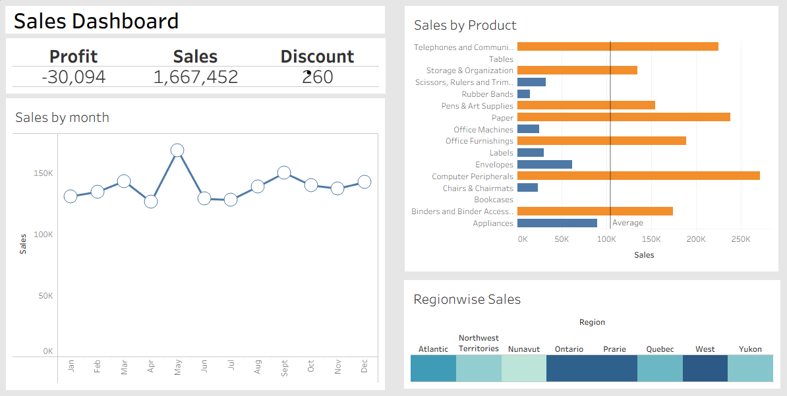

# 📊 Sales Dashboard Mini Project

## 📝 Project Overview
This mini project demonstrates how to build a **basic interactive dashboard** in **Tableau** using a cleaned sales dataset.  
The dashboard provides key insights such as sales trends, product performance, and regional distribution.

---

## 📂 Dataset
- **Source:** `sales.xlsx - Orders.csv`  
- **Contents:**  
  - 🆔 Order details (Order ID, Product Name, Category)  
  - 💰 Sales amount  
  - 📦 Quantity sold  
  - 👥 Customer and regional data  
  - 📅 Order dates  

---

## 🛠️ Steps Followed
1. **Data Cleaning (Python - Jupyter Notebook)**  
   - 🗑️ Removed duplicates and handled missing values.  
   - ⏳ Converted date columns to proper datetime format.  
   - 💾 Saved cleaned dataset as `sales_cleaned.csv`.  

2. **Dashboard Creatio (Tableau)**  
   - 📥 Imported the cleaned dataset into Tableau.  
   - 📈 Created visualizations such as:  
     - Sales over time.  
     - Top-performing products.  
     - Regional sales distribution.  
   - 🖼️ Combined visualizations into a single dashboard.  

---

## 🖼️ Dashboard Preview

---

## 🚀 How to Use
1. Open Tableau Desktop or Tableau Public.  
2. Load the `sales_cleaned.csv` file.  
3. Recreate or customize the dashboard using the provided visualizations.  
4. Publish or export the dashboard as needed.  
